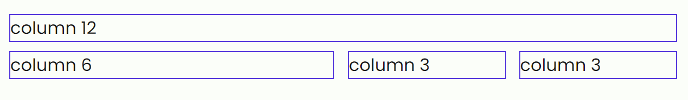

# Grid Flex

Grid-Flex uses display flex, so all [flex utilities](#flex-utilities) will work here.

To init a grid you have to create a `div` with a class `.row`.
Inside the `.row` element you can add as much as you need `.col` elements.

## Simple Grid

```html
<div class="row">
  <div class="col-12 borders">column 12</div>
  <div class="col-6 borders">column 6</div>
  <div class="col-3 borders">column 3</div>
  <div class="col-3 borders">column 3</div>
</div>
```


## Gutters

With the class `.gutters` you will give some spacing to the grid.

```html
<div class="row gutters justify-content-between">
  <div class="col-12 borders">column 12</div>
  <div class="col-6 borders">column 6</div>
  <div class="col-3 borders">column 3</div>
  <div class="col-3 borders">column 3</div>
</div>
```



There are five more available gutters from 1 to 5. To use them you can concatenate the number after gutters, for example: `.gutters-1`.

## Responsive

To make the grid responsive you can use the breakpoints!

```html
<div class="row gutters justify-content-between">
  <div class="col-12 borders">column 12</div>
  <div class="col-12 col-md-6 borders">column 12, md-6</div>
  <div class="col-3 borders">column 3</div>
  <div class="col-3 borders">column 3</div>
</div>
```


## Flex Utilities

`.direction-colum`

`.justify-content-center`

`.justify-content-end`

`.justify-content-start`

`.justify-content-between`

`.justify-content-around`

`.justify-content-evenly`

`.align-items-start`

`.align-items-end`

`.align-items-center`

`.align-items-stretch`
