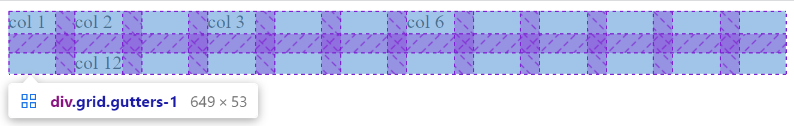
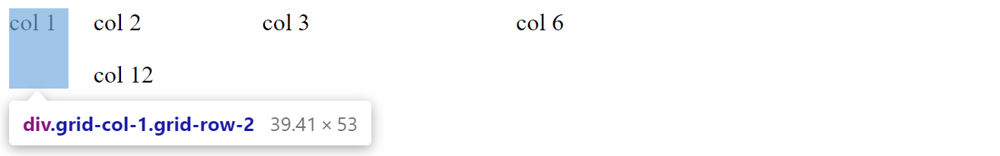
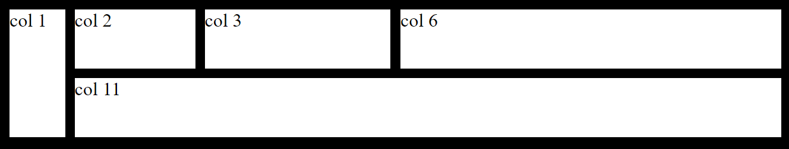

# Grid

This grid uses `diplay: grid` under the hood.

```html
<div class="grid gutters">
  <div class="grid-col-1 grid-row-2">col 1</div>
  <div class="grid-col-2">col 2</div>
  <div class="grid-col-3">col 3</div>
  <div class="grid-col-6">col 6</div>
  <div class="grid-col-11">col 11</div>
</div>
```



You can specify how many columns the cell will span by adding a number from 1 to 12. Ex: `.grid-col-1`

You can specify how many rows the cell will span by adding a number from 1 to 12. Ex: `.grid-row-2`



You can specify a gutter by adding `.gutters` to the `.grid` class. You can increase gutters by adding a number to the `.gutters` class from 1 to 5. Ex `.gutters-2`.


